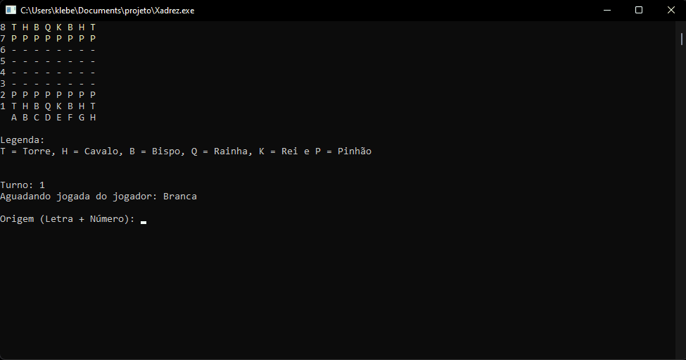
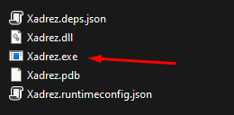

<h1 align="center">Projeto de tabuleiro de xadrez em console</h1>

 

Este projeto foi um dos desafios do curso de C# pra aplicar todo os concentos 
estudados no curso

Neste projeti tem todos os conceitode do jogo tradicional do tabuleiro, jogador 
joga a cada turno, é validado posição da peça e para onde esta indo, é considerado 
também os movimentos possíveis para cada tipo de peça.

<h3> Como se jogar</h3>

Ao executar o projeto ele ja inicia no tabuleiro com as peças no lugar, para 
movimentar as peças é necessário digitar a letra que representa a coluna e a 
numeração da linha.

 

Depois que termina sua jogarda o turno é passado para a outra pessoa. Você pode jogar sozinho e se desafiar ou com um amigo e se divertirem.

 

<h3>Como baixar e jogar</h3>

- Clique em download para ir para a página de download.
 
- [Download](https://drive.google.com/file/d/1--Zqu_LZ97ppR1VAgIq9k5hSvlDZb2vN/view?usp=sharing)

- Clique no botão com a seta para baixo para inicar o download. 
  

 

- Assim que terminar o download do arquivo [ZIP](https://www.win-rar.com/download.html?&L=9).
 

- Extraia os arquivo em uma pasta e execute o arquivo xadrez.exe.
  

 

<h4>Técnologias</h4>

Neste projeto foi usado as técnologias
- [C#](https://docs.microsoft.com/pt-br/dotnet/csharp/)
- [.NET](https://docs.microsoft.com/pt-br/dotnet/)
